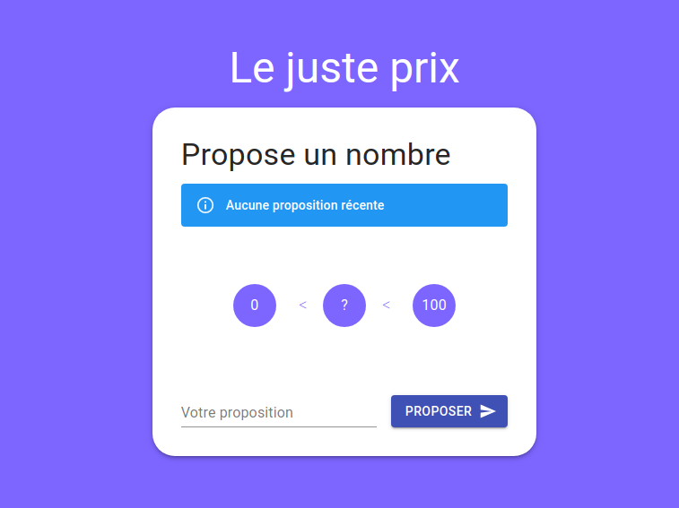
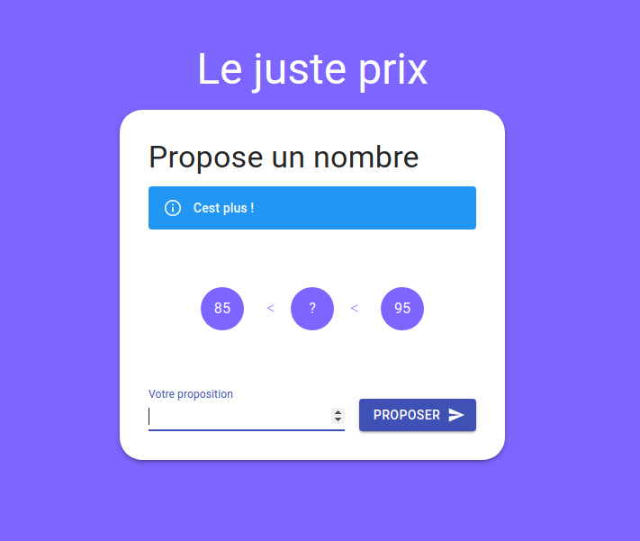
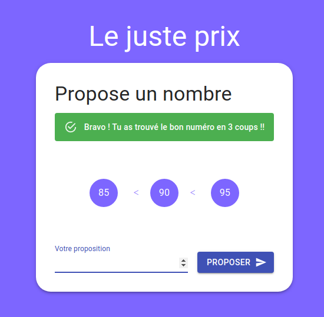

# La fourchette graphique

La voici, la voila, la fameuse FOURCHETTE ! Mais version graphique cette fois !

Bon c'est un bon gros exercice en autonomie, t'a du bol y'a la correction sur la branche **correction**  
Je te laisse regarder par toi même. Mais ne triche pas sinon ça sert à rien :sweat_smile:

## Conception

Ici il faudra utiliser la librairie graphique [material-ui](https://material-ui.com/).  
Bon c'est du material ui, c'est plus qu'une lib, c'est un concept de google en design cf. https://material.io/design  

La lib est pas hyper simple à prendre en main, donc n'hésite pas à faire un truc sans au départ et de l'ajouter ensuite !

Bon voila sinon c'est comme avant, tu rentre un chiffre, 

- si c'est plus, tu le marques dans le cercle de gauche, et tu informes l'utilisateur que c'est plus
- Si c'est moins, tu le marques dans le cercle de droite, et tu informes l'utilisateur que c'est moins
- Si c'est max, tu le marques dans le cercle du centre, et tu informes l'utilisateur qu'il a gagné en XX coups

Il y aura donc .... Un compteur de coups :wink:

A toi de faire comme tu veux. La correction n'est qu'une proposition, et elle n'est pas parfaite !

### Un exemple quand c'est plus

### Un exemple quand c'est gagné

Bon courage à toi !! :muscle:
