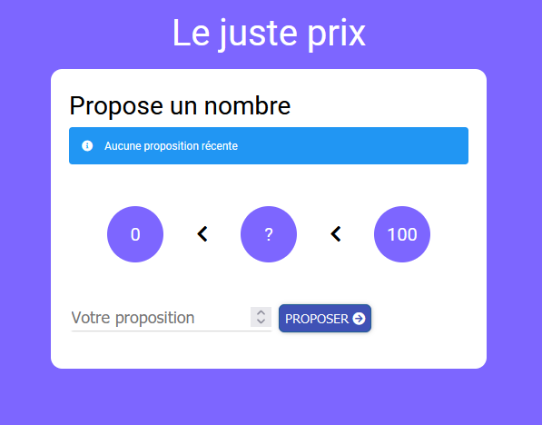

# La Fourchette

A simple game with React

## Table of contents

- [Overview](#overview)
  - [The challenge](#the-challenge)
  - [Screenshot](#screenshot)
  - [Links](#links)
- [My process](#my-process)
  - [Built with](#built-with)

## Overview

### The challenge

Users should be able to:

- Propose a number
- know if the number is larger or smaller than the number to find
- reload the game

### Screenshot

#### Desktop version :

#### Mobile version :

### Links

- Live Site URL: [Fourchette Game](http://fourchette-game-emma.surge.sh/)

## My process

### Built with

- HTML
- CSS
- SASS
- [React](https://reactjs.org/) - JS library
